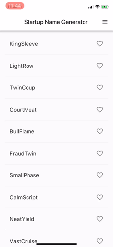
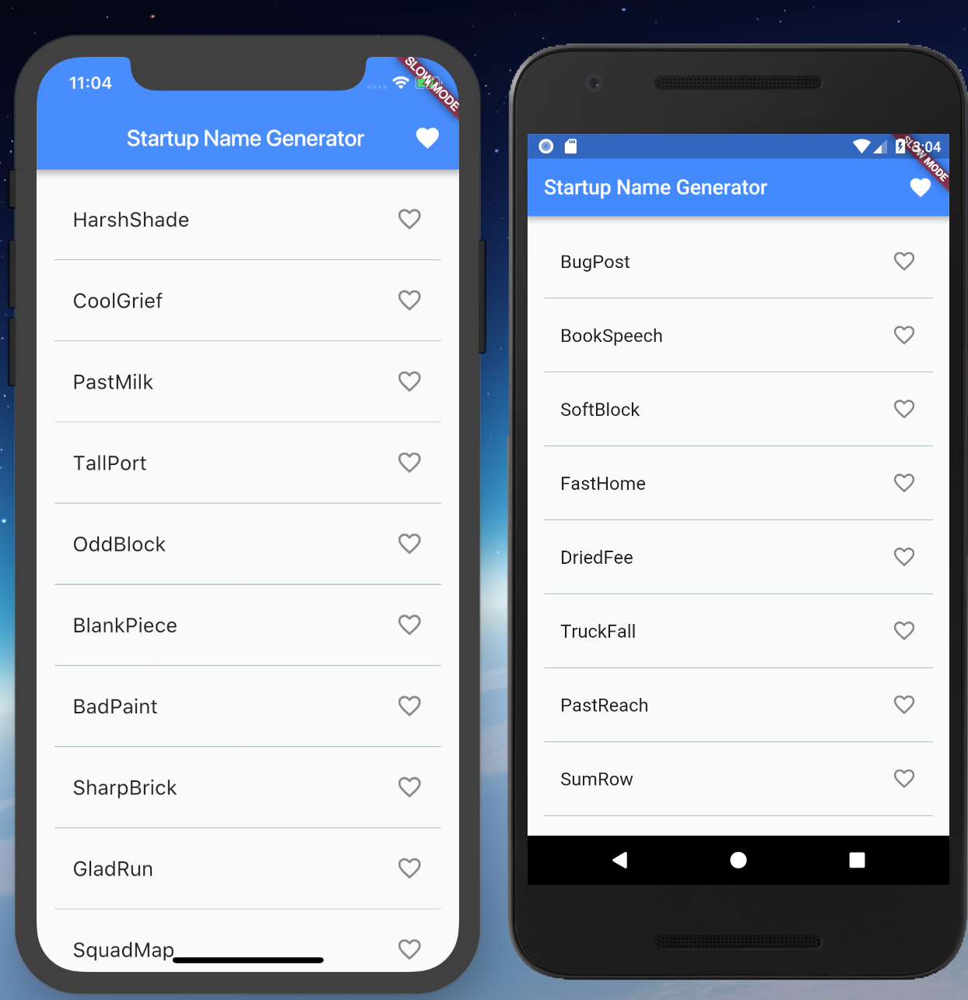

# startup_namer

"a simple mobile app that generates proposed names for a startup company. The user can select and unselect names, saving the best ones. The code generates ten names at a time. As the user scrolls, new batches of names are generated. The user can tap the list icon in the upper right of the app bar to move to a new route that lists only the favorited names." [source](https://flutter.io/get-started/codelab/)

<figure class="right-figure" style="max-width: 260px; padding-right: 10px">
    
</figure>

#### Deployed on IOS and Android

